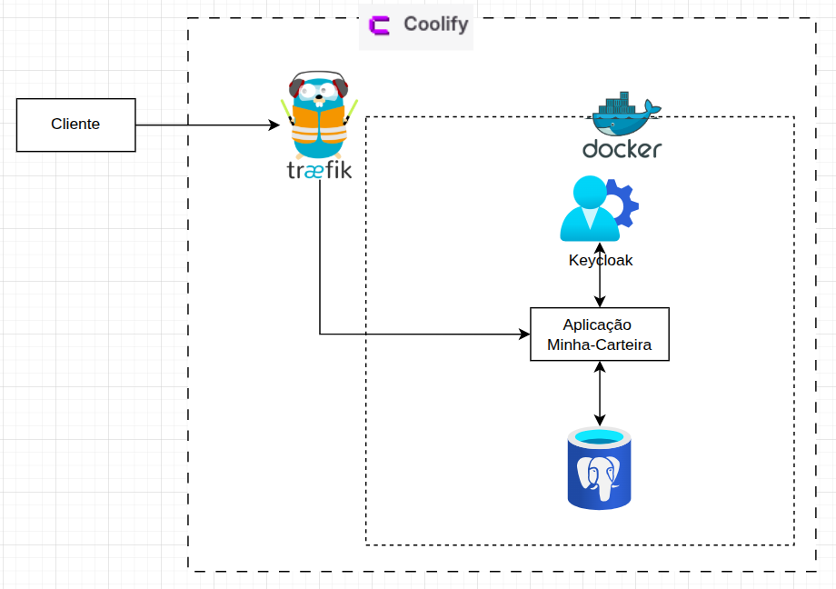
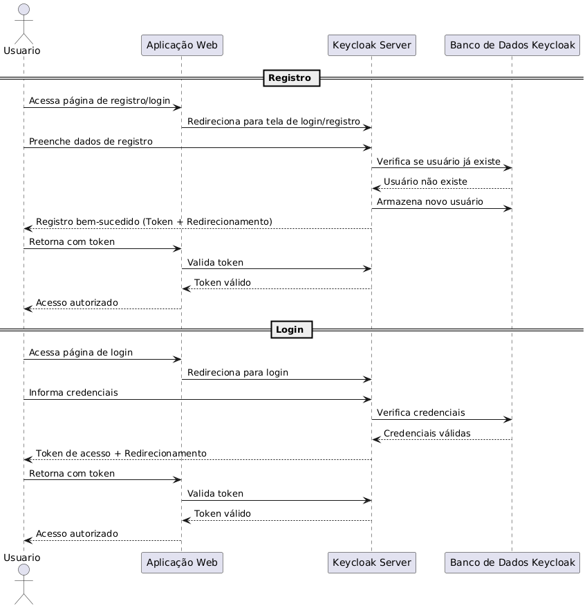

# Documentação do Projeto: Carteira Financeira (Desafio Full Stack Grupo Adriano Cobuccio)

**Versão:** 1.1 
**Data:** 15/05/2025
**Autor(es):** Itallo Gravina

---

## Sumário

1. [Introdução](#1-introdução)
   1.1. [Objetivo do Projeto](#11-objetivo-do-projeto)
   1.2. [Contexto](#12-contexto)
   1.3. [Escopo](#13-escopo)
2. [Requisitos](#2-requisitos)
   2.1. [Funcionais](#21-funcionais)
   2.2. [Não Funcionais](#22-não-funcionais)
3. [Arquitetura da Solução](#3-arquitetura-da-solução)
   3.1. [Visão Geral](#31-visão-geral)
   3.2. [Componentes Principais](#32-componentes-principais)
   3.3. [Fluxos Principais](#33-fluxos-principais)
   3.4. [Modelagem de Dados](#34-modelagem-de-dados-simplificada---postgresql)
4. [Tecnologias Utilizadas](#4-tecnologias-utilizadas)
5. [Justificativas das Escolhas (Design Decisions)](#5-justificativas-das-escolhas-design-decisions)
6. [Segurança](#6-segurança)
7. [Tratamento de Erros](#7-tratamento-de-erros)
8. [Testes](#8-testes)
9. [Observabilidade](#9-observabilidade)
10. [Instruções de Setup e Execução](#10-instruções-de-setup-e-execução)
11. [Considerações Futuras / Melhorias](#11-considerações-futuras--melhorias)

---

## 1. Introdução

### 1.1. Objetivo do Projeto

O objetivo deste projeto é desenvolver uma interface funcional equivalente a uma carteira financeira, permitindo aos usuários realizar cadastro, autenticação, envio, recebimento e depósito de dinheiro, gerenciar uma lista de contatos para facilitar transferências, além de possibilitar a reversão de transações. Este projeto foi desenvolvido como parte do desafio Full Stack.

### 1.2. Contexto

Este documento descreve a solução proposta para o desafio, detalhando a arquitetura, tecnologias, decisões de design e funcionalidades implementadas.

### 1.3. Escopo

**O sistema DEVE permitir:**

* Cadastro de novos usuários.
* Autenticação de usuários existentes.
* Operações de depósito em conta.
* Operações de transferência de saldo entre usuários.
* Operações de recebimento (como consequência de transferências).
* Validação de saldo antes da transferência.
* Depósito em contas com saldo negativo (acrescentando ao valor).
* Reversão de operações de transferência ou depósito.
* **Gerenciamento de contatos:**
  * Adicionar um novo contato (nome e e-mail).
  * Listar os contatos salvos pelo usuário.
  * Remover um contato.
  * Utilizar um contato salvo para preencher dados de transferência.

**O sistema NÃO contempla (nesta fase):**

* Interface de frontend complexa,
* Tipos diferentes de moeda,
* Relatórios financeiros detalhados,
* Sincronização de contatos com outras plataformas

---

## 2. Requisitos

### 2.1. Funcionais

Conforme o objetivo e escopo:

* **RF001:** O sistema deve permitir o cadastro de novos usuários (nome, e-mail, senha, etc.).
* **RF002:** O sistema deve permitir a autenticação de usuários cadastrados.
* **RF003:** Usuários autenticados devem poder visualizar seu saldo.
* **RF004:** Usuários autenticados devem poder depositar dinheiro em sua própria carteira.
* **RF005:** Usuários autenticados devem poder transferir dinheiro para outros usuários cadastrados no sistema.
* **RF006:** O sistema deve validar se o usuário tem saldo suficiente antes de uma transferência.
* **RF007:** Se o saldo do usuário estiver negativo, o depósito deve acrescentar ao valor existente (ex: saldo -10, depósito de 50, novo saldo 40).
* **RF008:** Qualquer operação de transferência ou depósito deve ser passível de reversão, seja por inconsistência ou solicitação do usuário.
* **RF009:** Usuários autenticados devem poder adicionar um novo contato, informando um nome/apelido e o e-mail do contato.
* **RF010:** Usuários autenticados devem poder listar todos os seus contatos salvos.
* **RF011:** Usuários autenticados devem poder remover um contato de sua lista.
* **RF012:** Ao iniciar uma transferência, o usuário deve poder selecionar um contato de sua lista para preencher automaticamente o e-mail do destinatário.

### 2.2. Não Funcionais

* **RNF001 - Segurança:** A aplicação deve garantir a segurança dos dados do usuário e das transações.
* **RNF002 - Código Limpo:** O código deve ser legível, bem estruturado e de fácil manutenção.
* **RNF003 - Tratamento de Erros:** A aplicação deve tratar erros de forma adequada.
* **RNF004 - Argumentação:** As escolhas de design e tecnologia devem ser justificáveis.
* **RNF005 - Padrões de Projeto e SOLID:** Aderência aos princípios SOLID e uso de padrões de projeto.
* **RNF006 - Modelagem de Dados:** Modelagem eficiente do banco de dados.
* **(Diferencial) RNF007 - Containerização:** Aplicação executável via Docker.
* **(Diferencial) RNF008 - Testabilidade:** Design para testes unitários e de integração.
* **(Diferencial) RNF009 - Documentação:** Projeto bem documentado.
* **(Diferencial) RNF010 - Observabilidade:** Nível de monitoramento/

---

## 3. Arquitetura da Solução

### 3.1. Visão Geral

A arquitetura da solução está representada no diagrama abaixo:



A solução é composta por uma aplicação backend ("Aplicação Minha-Carteira") desenvolvida em PHP com o framework CodeIgniter. A autenticação é delegada ao Keycloak. Todas as aplicações são containerizadas com Docker e orquestradas/gerenciadas pela plataforma Coolify. O Traefik atua como reverse proxy. O PostgreSQL é utilizado como banco de dados.

### 3.2. Componentes Principais

* **Cliente:** Usuário final ou sistema externo interagindo com a API via HTTP/S.
* **Coolify:** Plataforma PaaS para deploy e gerenciamento dos serviços Dockerizados.
* **Traefik:** Reverse proxy e load balancer, roteando requisições e gerenciando SSL/TLS.
* **Docker:** Plataforma de containerização para empacotar a aplicação e dependências.
* **Keycloak:** Solução de Gerenciamento de Identidade e Acesso (IAM) para autenticação e emissão de tokens JWT.
* **Aplicação Minha-Carteira:** CodeIgniter com a lógica de negócio (cadastro, carteiras, transações, reversão, **gerenciamento de contatos**).
* **Banco de Dados (PostgreSQL):** Persistência de dados da aplicação (usuários, carteiras, transações, **contatos**).

### 3.3. Fluxos Principais

Os fluxos de Registro e Login são gerenciados principalmente pelo Keycloak, com a "Aplicação Web" (ou cliente) orquestrando o redirecionamento e o manuseio do token. O diagrama de sequência abaixo ilustra esses processos:



**Cadastro de Usuário (Fluxo de Registro):**

1. **Usuário** acessa página de registro/login na **Aplicação Web**.
2. **Aplicação Web** redireciona para tela de login/registro do **Keycloak Server**.
3. **Usuário** preenche dados de registro no **Keycloak Server**.
4. **Keycloak Server** verifica no **Banco de Dados Keycloak** se usuário já existe.
5. Se não existe, **Banco de Dados Keycloak** confirma.
6. **Keycloak Server** armazena novo usuário no **Banco de Dados Keycloak**.
7. **Keycloak Server** retorna sucesso (com token/código e redirecionamento) ao **Usuário** para a **Aplicação Web**.
8. **Usuário** (navegador) retorna à **Aplicação Web** com token/código.
9. **Aplicação Web** valida token/código com **Keycloak Server**.
10. **Keycloak Server** confirma validade.
11. **Aplicação Web** concede acesso autorizado ao **Usuário**.
12. *Posteriormente, a "Aplicação Minha-Carteira" (backend) cria a carteira financeira no PostgreSQL para este novo usuário.*

    **Autenticação de Usuário (Fluxo de Login):**
13. 1. **Usuário** acessa página de login na **Aplicação Web**.
    2. **Aplicação Web** redireciona para tela de login do **Keycloak Server**.
    3. **Usuário** informa credenciais no **Keycloak Server**.
    4. **Keycloak Server** verifica credenciais no **Banco de Dados Keycloak**.
    5. **Banco de Dados Keycloak** confirma validade.
    6. **Keycloak Server** retorna token de acesso (JWT) e redirecionamento ao **Usuário** para a **Aplicação Web**.
    7. **Usuário** (navegador) retorna à **Aplicação Web** com token.
    8. **Aplicação Web** pode validar token com **Keycloak Server**.
    9. **Keycloak Server** confirma validade.
    10. **Aplicação Web** concede acesso autorizado ao **Usuário**.
    11. *Requisições subsequentes para a "Aplicação Minha-Carteira" (API backend) devem incluir este token JWT.*
14. **Operação Financeira (Depósito/Transferência):**

    1. **Usuário** (autenticado, com JWT) envia requisição à API "Aplicação Minha-Carteira".
       * *Para transferência, o usuário pode opcionalmente fornecer um `contact_id` ou o e-mail do destinatário. Se `contact_id` for fornecido, a aplicação busca o e-mail do contato.*
    2. **Aplicação Minha-Carteira** recebe a requisição.
    3. **Aplicação Minha-Carteira** valida o token JWT (assinatura, expiração, etc., usando chave pública do Keycloak).
    4. Se válido, identifica o usuário.
    5. Executa lógica de negócio (validações, regras, *busca e-mail do contato se `contact_id` fornecido*).
    6. Atualiza saldos e registra transação no **PostgreSQL**.
    7. Retorna resposta ao **Usuário**.
15. **Reversão de Transação:**

    1. **Usuário** (autenticado) ou administrador solicita reversão via API "Aplicação Minha-Carteira".
    2. Requisição chega com token JWT válido.
    3. **Aplicação Minha-Carteira** valida token e permissões.
    4. Localiza transação original no **PostgreSQL**.
    5. Executa lógica de reversão.
    6. Atualiza saldos e registra transação de reversão no **PostgreSQL**.
    7. Retorna resposta.
16. **Gerenciamento de Contatos:**

    <pre class="vditor-reset" placeholder="" contenteditable="true" spellcheck="false"><p data-block="0"></p></pre>

    * **Adicionar Contato:**
      1. **Usuário** (autenticado, com JWT) envia requisição (POST) para o endpoint de contatos da API "Aplicação Minha-Carteira", com nome e e-mail do contato.
      2. **Aplicação Minha-Carteira** valida o token e os dados do contato.
      3. **Verificação se o usuário existe** ocorre um verificação de existência do usuário na plataforma
      4. **Aplicação Minha-Carteira** salva o novo contato associado ao `usuario_id` no **PostgreSQL**.
      5. Retorna o contato criado ou confirmação de sucesso.
    * **Listar Contatos:**
      1. **Usuário** (autenticado, com JWT) envia requisição (GET) para o endpoint de contatos.
      2. **Aplicação Minha-Carteira** valida o token.
      3. **Aplicação Minha-Carteira** busca no **PostgreSQL** todos os contatos associados ao `usuario_id`.
      4. Retorna a lista de contatos.
    * **Remover Contato:**
      1. **Usuário** (autenticado, com JWT) envia requisição (DELETE) para o endpoint de um contato específico (ex: `/contatos/{contact_id}`).
      2. **Aplicação Minha-Carteira** valida o token e verifica se o contato pertence ao usuário.
      3. **Aplicação Minha-Carteira** remove o contato do **PostgreSQL**.
      4. Retorna confirmação de sucesso.

### 3.4. Modelagem de Dados (Simplificada - PostgreSQL)

* **`user`**
  * `id` (PK, `UUID` ou `BIGSERIAL`)
  * `keycloak_id` (`VARCHAR`, UNIQUE)
  * `nome` (`VARCHAR`)
  * `balance` (`Decimal`)
  * `email` (`VARCHAR`, UNIQUE)
  * `criado_em` (`TIMESTAMP`)
  * `atualizado_em` (`TIMESTAMP`)
* **`carteiras`**
  * `id` (PK, `UUID` ou `BIGSERIAL`)
  * `usuario_id` (FK para `usuarios.id`)
  * `saldo` (`DECIMAL(15,2)`, DEFAULT 0.00)
  * `criado_em` (`TIMESTAMP`)
  * `atualizado_em` (`TIMESTAMP`)
* **`transacoes`**
  * `id` (PK, `UUID` ou `BIGSERIAL`)
  * `carteira_origem_id` (FK para `carteiras.id`, NULL para depósitos)
  * `carteira_destino_id` (FK para `carteiras.id`)
  * `tipo_transacao` (`ENUM('DEPOSITO', 'TRANSFERENCIA', 'REVERSAO_DEPOSITO', 'REVERSAO_TRANSFERENCIA')`)
  * `valor` (`DECIMAL(15,2)`)
  * `status` (`ENUM('PENDENTE', 'CONCLUIDA', 'FALHOU', 'REVERTIDA')`, DEFAULT 'PENDENTE')
  * `transacao_original_id` (FK para `transacoes.id`, NULLABLE)
  * `descricao` (`TEXT`, opcional)
  * `criado_em` (`TIMESTAMP`)
  * `atualizado_em` (`TIMESTAMP`)
* **`contatos`** `<ins>`(NOVA TABELA)`</ins>`
  * `id` (PK, `UUID` ou `BIGSERIAL`)
  * `usuario_id` (FK para `usuarios.id` - O dono da lista de contatos)
  * `nome_contato` (`VARCHAR(255)` - Apelido/Nome do contato)
  * `email_contato` (`VARCHAR(255)`)
  * `criado_em` (`TIMESTAMP`)
  * `atualizado_em` (`TIMESTAMP`)
  * `UNIQUE (usuario_id, email_contato)` (Um usuário não pode ter o mesmo e-mail de contato duas vezes)

*Nota: Utilizar transações de banco de dados (BEGIN, COMMIT, ROLLBACK) é crucial para operações financeiras.*

---

## 4. Tecnologias Utilizadas

* **Linguagem Backend:** PHP
* **Framework Backend:** CodeIgniter
* **Banco de Dados:** PostgreSQL
* **Autenticação/Autorização:** Keycloak
* **Reverse Proxy:** Traefik
* **Containerização:** Docker & Docker Compose
* **Plataforma de Deploy:** Coolify
* **Controle de Versão:** Git

---

## 5. Justificativas das Escolhas (Design Decisions)

* **PHP & CodeIgniter:** Tecnologia desejada no desafio. Framework leve, MVC, desenvolvimento rápido.
* **PostgreSQL:** Robusto, suporte a transações ACID, escalável para o escopo.
* **Keycloak:** Delega gestão de identidade, facilita OAuth2/OIDC, aumenta segurança.
* **Docker:** Ambientes consistentes, facilita deploy. Requisito diferencial.
* **Traefik:** Simplifica roteamento, configuração dinâmica, SSL.
* **Coolify:** Automatiza deploy e gerenciamento de containers (experiência PaaS).
* **Arquitetura de Microsserviços (implícita):** Desacoplamento (Keycloak separado da lógica de negócio).

## 6. Segurança

* **Autenticação:** Keycloak e tokens JWT (Bearer Token) para proteger APIs.
* **Autorização:** "Aplicação Minha-Carteira" valida JWT e permissões do usuário (ex: usuário só pode gerenciar seus próprios contatos).
* **HTTPS:** Traefik força HTTPS, criptografando comunicação.
* **Validação de Entrada:** Prevenção contra XSS e garantia de integridade dos dados (incluindo dados de contato).
* **Prevenção de SQL Injection:** Prepared Statements ou ORM/Query Builder do CodeIgniter.
* **Proteção contra CSRF:** (Se houver frontend com formulários) Tokens CSRF.
* **Senhas:** Gerenciadas e armazenadas de forma segura pelo Keycloak.

---

## 7. Tratamento de Erros

* Uso de códigos de status HTTP padrão (200, 201, 400, 401, 403, 404, 500).
* Respostas de erro (4xx, 5xx) em JSON com mensagem clara e código de erro interno.
  ```json
  // Exemplo de erro 400 (ex: e-mail de contato inválido)
  {
    "error": "INVALID_CONTACT_EMAIL",
    "message": "O e-mail fornecido para o contato não é válido."
  }
  ```
* Exceções capturadas, com logs detalhados no servidor e resposta genérica ao cliente (500).
* Validações de negócio retornam erros 4xx específicos.

---

## 8. Testes

* **(Diferencial) Testes Unitários:**
  * **Ferramenta:** PHPUnit.
  * **Cobertura:** Classes de serviço, modelos, helpers, lógica crítica (incluindo lógica de gerenciamento de contatos).
  * [Como executar: `comando_para_rodar_testes_unitarios`]
* **(Diferencial) Testes de Integração:**
  * **Ferramenta:** PHPUnit ou [Outra Ferramenta].
  * **Cobertura:** Interação entre componentes (API-DB para CRUD de contatos, API-Keycloak).
  * [Como executar: `comando_para_rodar_testes_integracao`]
* **Testes Manuais:**
  * Validação dos fluxos principais com Postman/Insomnia (incluindo CRUD de contatos e uso de contatos em transferências).

---

## 9. Observabilidade

* **(Diferencial) Logging:**
  * Aplicação (CodeIgniter) registra eventos, erros, requisições (incluindo operações de contatos).
  * Níveis de log (DEBUG, INFO, WARNING, ERROR).
  * Logs de containers via Docker/Coolify.
* **(Opcional/Futuro) Monitoramento:** [Prometheus, Grafana].
* **(Opcional/Futuro) Tracing Distribuído:** [Jaeger, Zipkin].

---

## 10. Instruções de Setup e Execução

**Pré-requisitos:**

* Docker: [Link para instalação do Docker]
* Docker Compose: [Link para instalação do Docker Compose]
* Git

**Passos para Execução Local:**

1. **Clonar o repositório:**

   ```bash
   git clone [URL_DO_SEU_REPOSITORIO]
   cd [NOME_DO_DIRETORIO_DO_PROJETO]
   ```
2. **Configurar Variáveis de Ambiente:**

   * Copie `.env.example` para `.env`:
     ```bash
     cp env.example .env
     ```
   * Edite `.env` com as configurações (DB, Keycloak URLs, etc.). Ex:
     ```dotenv
     DB_HOST=minha-carteira-db
     DB_DATABASE=minha_carteira_app
     DB_USERNAME=appuser
     DB_PASSWORD=secret
     KEYCLOAK_URL=http://localhost:8081
     KEYCLOAK_REALM=minha-carteira-realm
     # ... outras variáveis
     ```

3. **Configuração do Keycloak (se manual):**

   * Acesse Keycloak (ex: `http://localhost:8081`).
   * Crie Realm (ex: `minha-carteira-realm`).
   * Crie Cliente para "Aplicação Minha-Carteira".
   * Crie usuários de teste.
   * [Detalhar passos específicos ou referenciar script/exportação de realm.]
4. **Subir os Containers:**

   ```bash
   docker-compose up -d --build
   ```
5. **Executar Migrations (CodeIgniter):**

   * Acesse o container da aplicação:
     ```bash
     docker-compose exec aplicacao-minha-carteira bash
     ```
   * Dentro do container:
     ```bash
     php spark migrate
     ```
   * Saia: `exit`
6. **Acessar a Aplicação:**

   * Aplicação: `http://localhost:[PORTA_TRAEFIK_OU_APP]`
   * Keycloak: `http://localhost:[PORTA_KEYCLOAK]`


**Parar os Containers:**

```bash
docker-compose down
```
